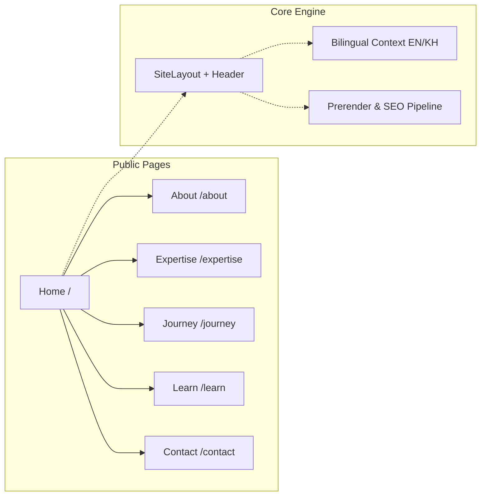

<p align="center">
  
</p>

<h1 align="center">Narin Phin — English Educator & Academic Leader</h1>

<p align="center">
  <strong>Thirty years of English education, academic leadership, curriculum expertise, and community learning in Phnom Penh, Cambodia.</strong>
</p>

<p align="center">
  <a href="https://narinphin-one.vercel.app"></a>
  <a href="https://github.com/christpor/narinphin"></a>
  <a href="https://www.youtube.com/@narinphin"></a>
  
</p>

<p align="center">
  <a href="https://narinphin-one.vercel.app">🌐 Live Portfolio</a> •
  <a href="https://www.youtube.com/@narinphin">📺 YouTube Channel</a> •
  <a href="#-quick-start">⚡ Quick Start</a> •
  <a href="#-tech-stack">🛠️ Tech Stack</a> •
  <a href="#-architecture--routes">🏛️ Architecture</a> •
  <a href="#-license">📜 License</a>
</p>

---

## 🌟 Highlights

- 🏛️ **30+ Years of Educational Leadership:** Built on verified career milestones across Cambodian Children’s Fund (CCF), Western University, and Grace International School.
- 🇰🇭 **Bilingual Khmer/English System:** Zero-compromise Khmer typography using `Kantumruy Pro` with line-height protection (`leading-snug`) and localStorage state persistence.
- 🎨 **The Scholarly Atelier Aesthetic:** Pure mineral white canvas, deep evergreen ink (`#173F37`), and warm terracotta-copper accents (`#C46849`).
- ⚡ **Modern React 19 Foundation:** Lightning-fast Vite 7 bundle, Tailwind CSS v4, Wouter SPA routing, and Lenis smooth momentum scrolling.
- 🔍 **Full SEO & Static Prerendering:** Route-level JSON-LD schemas, dynamic OpenGraph meta tags, `sitemap.xml`, and automated static route prerendering.
- 📺 **Creator Channel Integration:** Direct connection to Narin's YouTube channel ([@narinphin](https://www.youtube.com/@narinphin)) with 220+ public English lessons.

---

## ⚡ Quick Start

Get the project running locally in under 30 seconds:

```bash
# Clone the repository
git clone https://github.com/christpor/narinphin.git
cd narinphin

# Install dependencies
pnpm install

# Start local development server (http://localhost:3000)
pnpm dev
```

### Production Build & Static Prerendering

```bash
# Typecheck and build static production bundle
pnpm check
pnpm build

# Deploy to Vercel
vercel deploy --prod --yes
```

---

## 🛠️ Tech Stack

| Layer | Technology | Purpose |
| :--- | :--- | :--- |
| **Framework** | [React 19](https://react.dev/) + [TypeScript](https://www.typescriptlang.org/) | Strict type safety & concurrent rendering |
| **Build Tool** | [Vite 7](https://vitejs.dev/) | Sub-second HMR & optimized production bundling |
| **Styling** | [Tailwind CSS v4](https://tailwindcss.com/) | Modern CSS tokens & responsive utilities |
| **Typography** | `Kantumruy Pro` + `DM Serif Display` + `Manrope` | High-craft bilingual typographic hierarchy |
| **Routing** | [Wouter](https://github.com/molefrog/wouter) | Ultra-lightweight SPA routing |
| **Motion** | [Lenis](https://lenis.darkroom.engineering/) + [Framer Motion](https://www.framer.com/motion/) | Momentum smooth scroll & editorial reveals |
| **Deployment** | [Vercel](https://vercel.com/) | Edge CDN hosting with SPA fallback rewrites |

---

## 🏛️ Architecture & Routes



| Route | Purpose | Focus Area |
| :--- | :--- | :--- |
| [`/`](file:///home/christ/narinphin/client/src/pages/Home.tsx) | **Home** | Asymmetric hero, 3 evidence markers, route cards, YouTube spotlight |
| [`/about`](file:///home/christ/narinphin/client/src/pages/About.tsx) | **About** | Biography, academic credentials (M.A., B.Ed.), teaching values |
| [`/expertise`](file:///home/christ/narinphin/client/src/pages/Expertise.tsx) | **Expertise** | Curriculum design, teacher mentorship, academic assessment |
| [`/journey`](file:///home/christ/narinphin/client/src/pages/Journey.tsx) | **Journey** | 30-year chronological timeline (CCF, Western Univ, GIS) |
| [`/learn`](file:///home/christ/narinphin/client/src/pages/Learn.tsx) | **Learn** | Public video series, life skills, and student resources |
| [`/contact`](file:///home/christ/narinphin/client/src/pages/Contact.tsx) | **Contact** | Direct Gmail enquiry action with pre-filled templates |

---

## 🤖 Context Engineering & AI Protocols

This repository is governed by the **Context Engineering OS (Tier 2/3)**:
- [`AGENTS.md`](file:///home/christ/narinphin/AGENTS.md) — 16-line Router with Ponytail Mode (`Deletion > Modification > Addition`).
- [`context/AGENT.md`](file:///home/christ/narinphin/context/AGENT.md) — 45-line 9-point Amnesia-proof sprint brain.
- [`context/USER.md`](file:///home/christ/narinphin/context/USER.md) — Operator profile & zero-slop design laws.
- [`context/SOUL.md`](file:///home/christ/narinphin/context/SOUL.md) — 7-Rung Ponytail Ladder & execution rules.
- [`context/LAWS.md`](file:///home/christ/narinphin/context/LAWS.md) — Deep architectural reference & Khmer typography rules.

---

## 📜 License

This project is open source and available under the [MIT License](file:///home/christ/narinphin/LICENSE).
